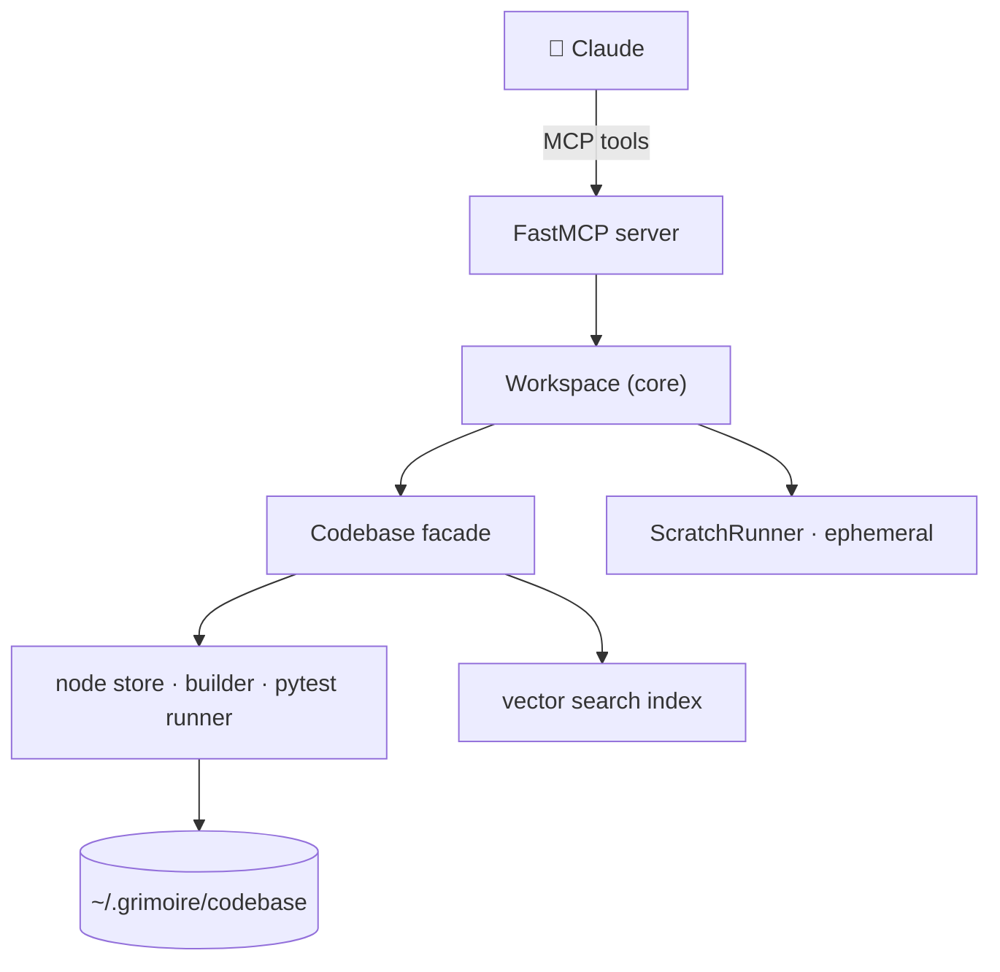

<div align="center">

# 🪄 Grimoire

### A spellbook of reusable code for Claude

**A persistent, test-gated, semantically-searchable library that Claude grows, composes, and casts — served over the [Model Context Protocol](https://modelcontextprotocol.io).**

[](https://www.python.org/)
[](https://modelcontextprotocol.io)
[](LICENSE)


</div>

---

Instead of re-reading an entire codebase to recall what exists, Claude **searches Grimoire by meaning**, reuses a capability as a dependency, or writes a new one — and new code enters the library **only once its tests pass**. Everything lives on disk and persists across sessions.

## ✨ Highlights

- 🔍 **Search before writing** — semantic search over every node's description + tags, so Claude reuses instead of duplicating.
- ✅ **Tests are the gate** — code enters only through `implement`, which builds it in isolation and requires its tests to pass.
- 🧩 **Composable** — nodes declare dependencies on other nodes; cross-node imports are generated automatically.
- 🪶 **Lean by design** — hide internal helpers from search (`searchable=False`) and classify callable **tools** vs **helpers** (`is_tool`).
- 💾 **Persistent** — stored on disk under a configurable root; reloads across sessions.
- ⚡ **Scratch execution** — prototype throwaway macros against built code without polluting the library.

## 🚀 Quick start

Install the `grimoire` command in one line with [pipx](https://pipx.pypa.io), then register it with Claude Code:

```bash
pipx install git+https://github.com/oh54321/grimoire.git
claude mcp add grimoire --scope user -- "$(command -v grimoire)"
```

`--scope user` registers it for every project; `"$(command -v grimoire)"` pins the **absolute path** at install time, so the server keeps launching even if your `PATH` changes between shells or environments. (Plain `-- grimoire` works too, but only while `grimoire` happens to be on the `PATH` Claude is started with.)

<details>
<summary>Other ways to install</summary>

**Clone + script** — auto-detects pipx / uv / venv:
```bash
git clone https://github.com/oh54321/grimoire.git
cd grimoire && ./install.sh
```

**Zero-install with [uv](https://docs.astral.sh/uv/)** — no install step; register the `uvx` invocation itself as the MCP command (uv resolves it on each launch, so there's no PATH dependence):
```bash
claude mcp add grimoire --scope user -- uvx --from git+https://github.com/oh54321/grimoire.git grimoire
```

**Plain pip**, in a virtualenv:
```bash
git clone https://github.com/oh54321/grimoire.git
cd grimoire && pip install .
```
</details>

<details>
<summary>Manual MCP client config</summary>

Use the **absolute path** to the installed binary for `command` (find it with `command -v grimoire`) so the server doesn't depend on the client's `PATH`:

```json
{
  "mcpServers": {
    "grimoire": {
      "command": "/home/you/.local/bin/grimoire",
      "env": { "GRIMOIRE_CODEBASE": "~/.grimoire/codebase" }
    }
  }
}
```
</details>

Python 3.11+. The first run downloads a sentence-transformers embedding model.

## 🧭 How it works

Grimoire is a thin MCP layer over a node-graph code store. Each **code node** (method / class / executable) carries a description, dependencies, tests, a `searchable` flag, and an `is_tool` flag. The **builder** materializes each node to a module and generates `from build.<dep> import <name>` for its dependencies — authors never write cross-node imports. The **runner** executes tests in an isolated, warm pytest worker; `implement` trial-builds a candidate and commits it **only if every test passes**.



The on-disk node store is the single source of truth; the build cache and search index are regenerable. Search is a vector index over descriptions + composite tags (`@kind:`, `@in:`, `@searchable:`, `@tool:`); tag / folder / type filters are **OR** (match-any), with hidden nodes gated out by default.

## ⚙️ Configuration

All via environment variables:

| Variable | Default | Meaning |
|---|---|---|
| `GRIMOIRE_CODEBASE` | `~/.grimoire/codebase` | Library root (persists across sessions) |
| `GRIMOIRE_MIN_TESTS` | `3` | Minimum passing tests `implement` requires |
| `GRIMOIRE_MAX_FOLDER_CHILDREN` | `7` | Hard cap per folder; the (N+1)th child is rejected `folder-full` |
| `GRIMOIRE_SCRATCH_TIMEOUT` | `30` | Seconds before a `run_scratch` run is killed |
| `GRIMOIRE_INGEST_ROOT` | `~/.grimoire/ingest` | Where the `ingest` prompt's ephemeral source clones live (read-only browse; never imported) |
| `GRIMOIRE_INGEST_TIMEOUT` | `60` | Seconds before a `fetch_source` git clone is killed |
| `GRIMOIRE_INGEST_TTL` | `86400` | Seconds before an idle ingest session is swept on the next `fetch_source` (0 disables) |

## 🛠️ Tools

| Group | Tools |
|---|---|
| **Find & reuse** | `discover` · `search` (OR filters · `include_hidden` · `is_tool`) · `search_tags` · `list_tags` |
| **Read** (stub-first) | `view` (signature + meta, not the body) · `read_code` · `read_tests` · `children` · `tree` |
| **Create & test** | `define` · `implement` *(the gate — code enters only here)* · `dirty` · `rebuild` |
| **Organize & classify** | `make_folder` · `move` (one or many) · `rename` · `remove` · `hide`/`show` · `mark_tool`/`mark_helper` · `health` |
| **Scratch** | `run_scratch(code, deps?)` — ephemeral; imports built nodes; never persisted |
| **Ingest** | `fetch_source` (git URL or local path → ephemeral read-only clone) · `survey_source` (AST symbol list) · `read_source` · `discard_source` — plus the `ingest` prompt that walks the workflow |

## 🔄 Workflow


Keep it lean: decompose into small nodes, hide narrow helpers (`searchable=False`), and mark internal building blocks as helpers (`is_tool=False`) so the searchable tool surface stays curated.

## 🧪 Development

```bash
pip install -e .
pytest -q
```

(`pytest` and `pytest-json-report` ship as runtime dependencies — the `implement` gate runs tests in a subprocess — so no separate test extra is needed.)

**Layout** — everything lives under one top-level package, `src/grimoire/`: `grimoire/codebase_mcp/` (MCP layer: `Workspace` core + thin FastMCP `server.py`) over `grimoire/api/` (`Codebase` facade), `grimoire/library/` (node store · builder · runner), and `grimoire/search/` (vector index).

## 🗺️ Roadmap

- Persist the vector index (currently re-embedded from the store on each open).
- **Codebase ingestion** ✅ — pull source from an external repo or MCP server into the library as test-gated nodes, via the `ingest` prompt (`fetch_source`/`survey_source`/`read_source` → `define`/`implement` → `discard_source`). Abandoned `~/.grimoire/ingest` sessions are reclaimed by a TTL sweep on the next `fetch_source` (`GRIMOIRE_INGEST_TTL`). Deferred hardening: sandbox network/process isolation.

## 📄 License

MIT © Oliver Hayman
